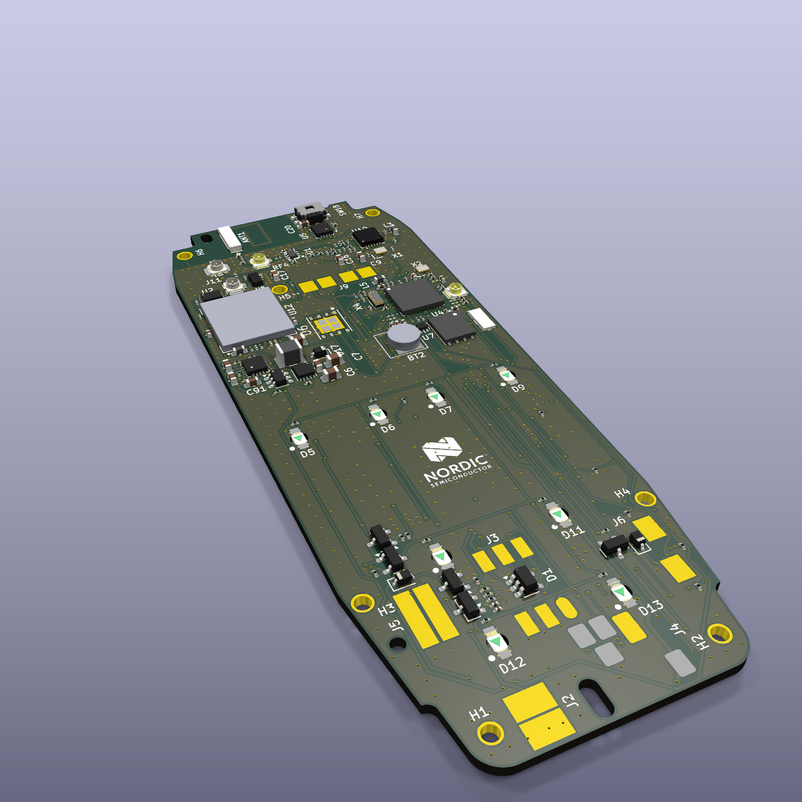
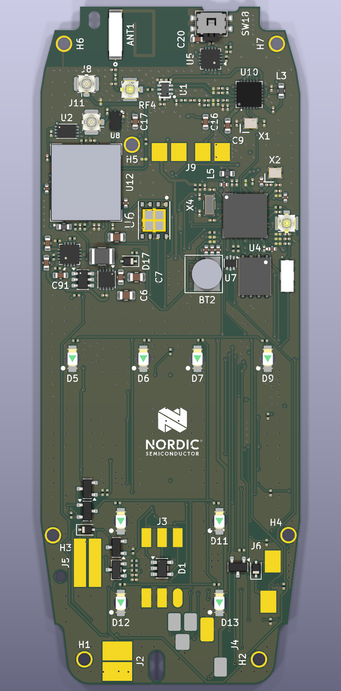
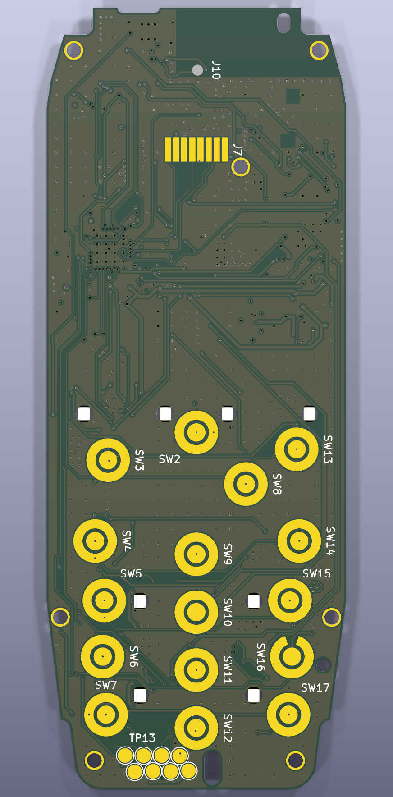

# The-Mesh3310-Project
Make the world's strongest node.

## 📱 Mesh3310: The Ultimate Off-Grid Communicator
Mesh3310 is an open-source hardware project that revives the legendary Nokia 3310 (Classic). It replaces the obsolete 2G internals with a modern, high-performance PCB.

The goal is to turn this indestructible icon into a rugged, long-range mesh networking node that runs **Meshtastic** and **MeshCore**.

  

## 🚀 The Vision
The Nokia 3310 is famous for its durability, tactile keypad and ergonomic design. Our custom board drops straight into the original housing and gives the phone a second life as a decentralized communicator that does not rely on cell towers or the internet. When a network *is* available, the built-in LTE modem can connect the mesh to the rest of the world.

## ⚡ Key Specifications
| Function | Part |
|---|---|
| MCU | Nordic **nRF52840** (Cortex-M4F, Bluetooth LE, USB) |
| LoRa | Semtech **SX1262** with a Skyworks SKY65723 front-end; on-board chip antenna in the original antenna area |
| Cellular / GNSS | Nordic **nRF9151** (LTE-M / NB-IoT, DECT NR+, GNSS); antennas via U.FL |
| Bluetooth antenna | On-board 2.4 GHz chip antenna |
| Power | TI BQ24074 charger + TPS63031 buck-boost, original 3310 battery contacts |
| Charging / USB | Through the original bottom connector (USB data to the nRF52840) |
| Display / input | Original PCD8544 monochrome LCD, full keypad with backlight, side power button |
| Audio | MAX98357A amplifier for the speaker, microphone, buzzer and vibration motor contacts |
| Storage | 2 × 16 Mbit flash (MX25R1635F), one for each Nordic chip |
| Firmware | Built to run Meshtastic and MeshCore |

## 🛠 Project Status: Rev. A layout complete 🏗️
- The schematic is complete and passes ERC.
- The **6-layer PCB** (JLCPCB stackup JLC06161H-3313) is fully routed, passes DRC and matches the schematic.
- Board outline, mounting holes, battery contacts, display, SIM, speakers, keypad and backlight LEDs match the original Nokia 3310 housing.
- Controlled-impedance RF lines (50 Ω) and a solid ground plane under all three radios.
- Every assembled part has an **LCSC part number**, ready for JLCPCB assembly.

Next steps: order the first prototypes, tune the RF matching networks and start firmware bring-up.

| Top | Bottom (keypad side) |
|---|---|
|  |  |

## 📂 Repository Layout
| Folder | Contents |
|---|---|
| `Kicad_Mesh3310/` | KiCad 9 project (schematic, PCB, libraries, 3D models) |
| `Kicad_Mesh3310/datasheets/` | Datasheets of the main components |
| `productie/` | Gerbers, drill files, pick-and-place file and BOM (JLCPCB format), plus manufacturing notes (Dutch) |
| `afbeeldingen/` | Renders of the board |

## 🤝 How You Can Help
We are actively looking for contributors. Your input can directly shape the hardware.

- **Hardware engineering**: review the schematic and layout, and help with RF tuning.
- **Firmware development**: port Meshtastic/MeshCore to the legacy LCD and keypad matrix.
- **Mechanical design**: check the fit in original and replacement shells, and design internal 3D-printed parts.

## 💬 Community & Contributing
Most of the coordination happens on Discord.

Join our Discord: https://discord.gg/E6Sk9hmUE

### Concept images

## License
MIT
